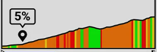
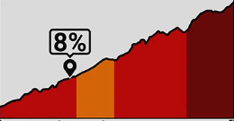

# VELOCUE 編輯頁功能規劃

最後更新：2026-03-25 (v3)
適用範圍：VELOCUE 官網編輯頁
用途：規劃頁面功能、排版、定義功能

## TODO

* [x] 地圖區塊顯示路線起點
* [x] 地圖區塊上的路線與坡度圖需要聯動（滑鼠放在路線則該位置也會同步顯示在坡度圖上）
* [ ] 改善坡度圖的上色問題，盡可能填滿色塊，參考下方附件圖 1774344177403.png, 1774344209850.png
* [ ] 改善坡度的上色問題2，遇到連續的爬升時，色塊將會連同下坡一同填滿
* [x] 坡度圖點擊後，不顯示 dialog，直接在表格區新增內容，預設寫入距離、坡度(%)，備註留空
* [x] 載入路線後，系統自動為較難爬坡點預先標記並寫入表格區，格式如 24k 6% 200m
* [x] 取消 EditDialog 流程，改為使用者直接在表格內編輯
* [x] 表格內容依距離由小到大排序
* [x] 使用者修改距離後，地圖與坡度圖上的對應標記位置同步更新
* [x] 表格最下方提供新增按鈕，點擊可新增空白列
* [x] 每列提供刪除按鈕，點擊後跳出 confirm，確認後刪除該列

## FUTURE

* [ ] 匯入googleMap路線

## 頁面功能

此頁是網站的核心功能頁面，接收用戶的gpx路線，並且顯示地圖與坡度供用戶參考，並且提供表格讓用戶自由編輯，最後輸出內容

**頁面定義**

1. 可上傳GPX檔案
2. 地圖區塊，在地圖上顯示競賽的路線圖，鼠標懸停在線上可同時坡度圖區塊內的相同位置
3. 坡度圖，由左至右顯示該競賽的坡度圖，鼠標懸停在線上可同時地圖區塊內的相同位置，左側顯示高度，下方為路程
4. 表格區塊，該區塊紀錄用戶編輯的內容，預設三欄為 距離、坡度、備註，另有功能欄可刪除

## 最新決策 (2026-03-24)

1. 保留「可編輯」但不保留 EditDialog；改為直接在表格 row 內編輯。
2. 自動標記為初始資料，使用者可任意修改或刪除，不區分 auto/manual 來源。
3. 地圖與坡度圖的聯動採「近似最近點」策略（效能優先）。
4. 自動標記在載入路線後直接寫入，不需額外按鈕。

## 自動爬坡門檻說明（1500 的意思）

此處的 1500 代表「爬坡分數」門檻，不是距離也不是坡度本身。

計算方式：

- 爬坡分數 = 爬坡段長度（公尺） × 平均坡度（%）

範例：

- 500m × 3% = 1500（剛好達標）
- 1000m × 2% = 2000（分數達標，但平均坡度 < 3%，不算）
- 300m × 8% = 2400（分數達標，但長度 < 500m，不算）

因此需同時滿足三條件：

1. 爬坡分數 >= 1500
2. 爬坡長度 >= 500m
3. 平均坡度 >= 3%

### 坡度圖顯示區塊

#### 功能

用戶以滑鼠點擊坡度後，直接在表格區塊新增一列（不開 dialog）

新增列預設值：

- 距離：點擊位置對應距離
- 坡度：點擊位置對應坡度（%）
- 備註：空白

#### 外觀

參考 garmin climb pro 功能進行開發

如何定義一個爬坡段？

ClimbPro 爬坡規劃器設計用意在於協助騎士進行陡峭爬坡路段的體力分配，而非在騎乘過程中偵測每個上坡路段。ClimbPro 使用計分系統對爬坡路段進行分類，其中的爬坡分數等於爬坡的長度（公尺）乘以坡度（%）。

須符合下列條件才會被歸類為爬坡路段：

* 爬坡分數至少為 1,500（分數 = 長度(公尺) × 坡度(%)）
* 爬坡段長度必須為 500 公尺以上。
* 平均坡度必須為 3% 以上。

所有 Edge 裝置在活動模式選單中皆提供一個控制選項，可用於定義要偵測的爬升量大小。預設偵測的爬升為「中型到大型爬升量」，其爬坡分數必須高於 3,500。啟用「所有爬升」可將爬坡分數門檻降低為 1,500，若選擇「僅大型爬升」則只會顯示分數高於 8,000 的爬坡路段。

## ClimbPro 畫面上的顏色分別代表什麼？

顏色以下列方式表示爬坡段的坡度：

* 在爬坡段預覽清單中，顏色表示爬坡段的整體平均坡度。
* 在個別爬升頁面上，顏色表示各個路段的詳細坡度。

| Cat | %     | Color    |
| --- | ----- | -------- |
| 4   | 0-3%  | green    |
| 3   | 3-6%  | yellow   |
| 2   | 6-9%  | orange   |
| 1   | 0-12% | red      |
| HC  | >12%  | Deep red |

備註：上色方式參考上圖

## 表格區格式規格

### 顯示與排序

- 表格不顯示表頭
- 預設三欄資料 + 一欄功能鍵
- 依「距離」由小到大排序
- row odd 使用 `bg-gray-200`，even 使用白色形成層次

### 欄位型態

1. 欄位 1：`input:number`（距離）
2. 欄位 2：`input:text`（坡度 / 補充）
3. 欄位 3：`input:text`（備註）
4. 欄位 4：功能鍵（目前為刪除）

### 輸入外觀

- 預設無邊框
- 點擊（focus）後顯示 outline

### 新增與刪除

- 最下方新增一列單欄，內含「新增」按鈕
- 點擊新增按鈕可建立空白列
- 每列右側有刪除按鈕
- 點擊刪除後跳出 confirm，確認後刪除該列

### 聯動規則

- 編輯距離欄位後，地圖與坡度圖上的標記位置同步移動
